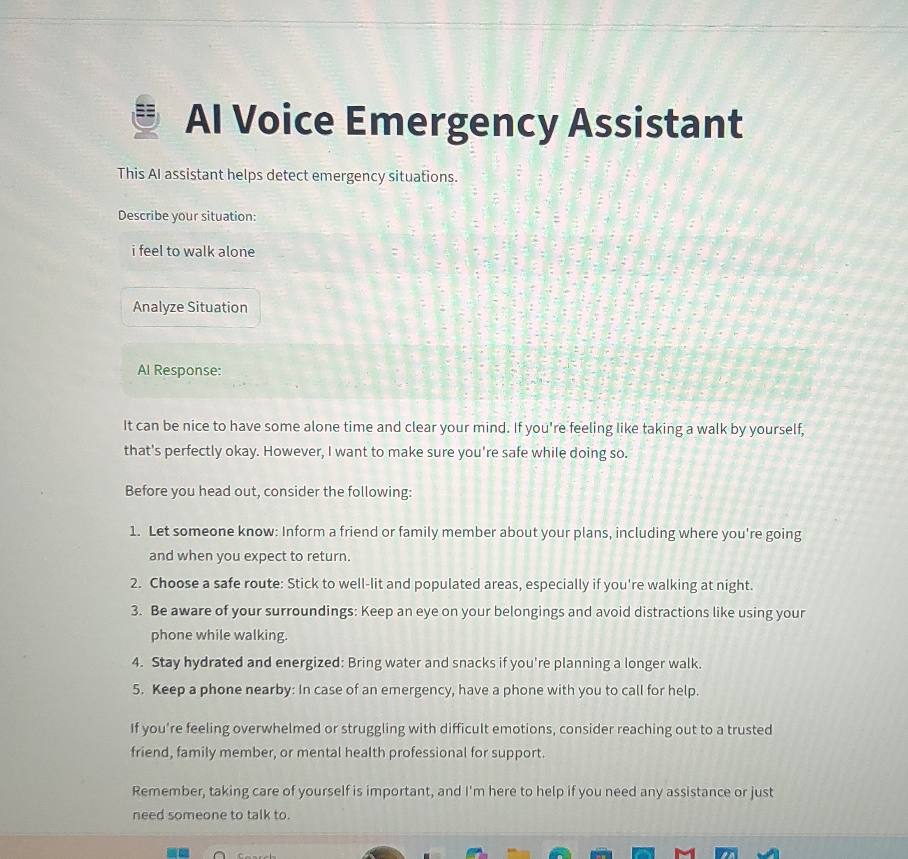

## 🎙️ AI Voice Emergency Assistant

  

  
  
  
  

---

### 🚀 Overview

## AI-powered Voice Emergency Assistant built using Groq API and Streamlit.

This project is part of my GenAI learning journey where I am exploring:

- LLM integration
- AI workflows
- Prompt engineering
- Streamlit application development
- Voice AI systems

---

### ✨ Current Features

✅ Streamlit User Interface
✅ Groq API Integration
✅ AI Response Generation
✅ Prompt-based Emergency Assistance

---

### 🛠️ Tech Stack

- Python
- Streamlit
- Groq API
- dotenv

---

### 📁 Project Structure

AI-Voice-Emergency-Assistant/
│
├── app.py
├── output.jpg
└── README.md

---

# 📸 Project Preview

  

---

### 🔄 Upcoming Improvements

- Voice-to-Text using Whisper
- Emergency Intent Detection
- LangChain Integration
- RAG-based Knowledge Retrieval
- Conversational Memory

---

### 📚 Learning Outcomes

✨ Learned Streamlit-based AI app development
✨ Understood LLM integration using Groq API
✨ Practiced Prompt Engineering basics
✨ Built foundation for Voice AI systems

---

### 👨‍💻 Author

Chandraprabha A

🎓 GenAI Intern @ DoWhistle
🚀 Learning AI Engineering & Voice AI Systems
