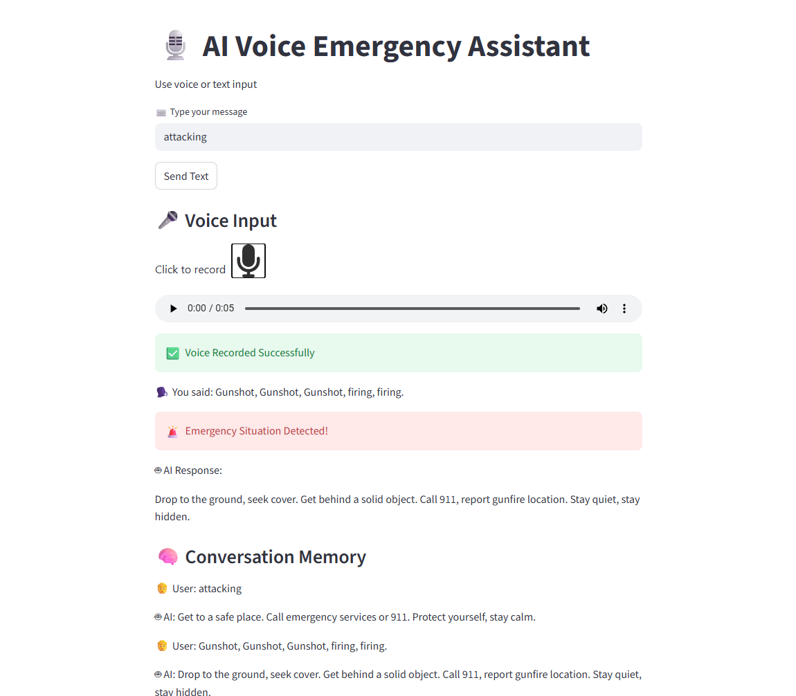

# 🎙️ AI Voice Emergency Assistant

A real-time AI-powered voice and text-based emergency detection system that identifies unsafe situations and provides instant safety guidance.

---

## 🚀 Overview

The AI Voice Emergency Assistant helps users detect emergency situations using AI. It supports both voice and text input and responds with safe, calm instructions when danger is detected.

---

## 🧠 Features

- 🎤 Voice Input (Speech-to-Text using Whisper)
- ⌨️ Text Input Support
- 🚨 AI Emergency Detection (YES / NO)
- 🤖 Smart Safety Responses using Groq LLM
- 💬 Conversation Memory
- ⚡ Fast AI responses
- 🎧 Audio recording inside Streamlit

---

## 🏗️ Project Structure

AI-Voice-Emergency-Assistant
│
├── app_voice.py        # Main Streamlit application
├── audio.wav           # Temporary voice recording file
└── README.md           # Project documentation

---

## 🧠 How It Works

1. User gives voice or text input  
2. Whisper converts voice → text  
3. AI detects emergency (YES / NO)  
4. If emergency → alert is shown 🚨  
5. AI generates safety guidance  
6. Conversation is stored in memory  

---

## 📸 Output Screenshot

### 🖥️ UI Output

---

## 💡 Example

User: I feel chest pain and cannot breathe  

AI: 🚨 Emergency detected!  
Please seek immediate medical help immediately.

---

## 📈 Future Improvements

- 📱 Mobile App Version  
- 🌍 Multi-language Support  
- 📍 Location-based Emergency Alerts  
- 📞 Direct Emergency Call Integration  
- 🛰️ SMS Alert System  

---

## 👨‍💻 Author

Chandraprabha A  
GenAI Intern 🚀  

---

## ⭐ Support

⭐ Star this repository  
🍴 Fork it  
📢 Share it
